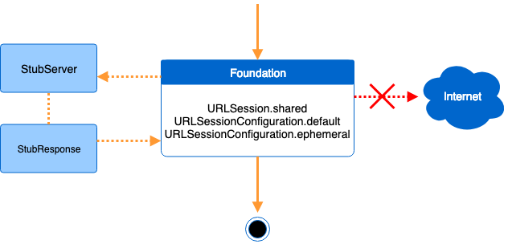

# LocalServer

[](https://travis-ci.org/db-in/LocalServer)
[](https://codecov.io/gh/db-in/LocalServer)
[](https://codebeat.co/projects/github-com-db-in-localserver-master)

[](https://db-in.github.io/LocalServer)
[](https://img.shields.io/cocoapods/v/LocalServer.svg)
[](https://github.com/Carthage/Carthage)

## Description
**LocalServer** is a framework that provides various options to create a Swift Local Server, that can independently run on simulators and devices, supporting Xcode Parallel Testing. It's made in Swift to create Stub Servers, UITest Servers and providing an easy to use Mock capabilities to create Testing doubles (fakes, stubs, spies and mocks). It supports all Apple platform iOS, MacOS, WatchOS and TVOS.

**Features**

- [x] Create Stub servers without changing or injecting any of your existing URLSession code
- [x] Create Stub versions for WKWebView
- [x] Supports Xcode Parallel Testing in simulators and devices
- [x] Stub Server for Unit Testing
- [x] UITest Stub Server for UI Testing

|Running App|UITest with Local Server|
|:---------:|:----------------------:|
|Random Users are generated|Only the mocked users are generated|
|||


## Installation

### Using [CocoaPods](https://cocoapods.org)

Add to your **Podfile** file

```
pod 'LocalServer'
```

### Using [Carthage](https://github.com/Carthage/Carthage)

Add to your **Cartfile** or **Cartfile.private** file

```
github "db-in/LocalServer"
```

### Using [Swift Package Manager](https://swift.org/package-manager)

Add to your **Package.swift** file

```swift
let package = Package(
    name: "myproject",
    dependencies: [
        .package(url: "https://github.com/db-in/LocalServer"),
    ],
    targets: [
        .target(
            name: "myproject",
            dependencies: ["LocalServer"]),
    ]
)
```

## Programming Guide
The features provided are:

- Stub Server
- UITest Server

#### Stub Server
The Stub Server is the base for the Local Server. It can intercept any network call made with the URLSession.



```swift
import LocalServer

func startMyLocalServer() {
    let server = StubServer()
		
	server.route([.GET], url: "https://apple.com") { (request, parameters) -> StubResponse in
		return StubResponse().withStatusCode(204)
	}
	
	server.route([.POST], url: "https://apple.com") { _,_ in
		return StubResponse().withStatusCode(206)
	}
		
	StubServer.instance = server
}
```

Once the `StubServer.instance` is defined as non-nil, it will spin the Local Server. To stop the Local Server just set it back to `nil`, which is the default value.

These are some of the handful functions for creating `StubResponse`:

```swift
StubResponse(string: "UTF8 string to become body")
StubResponse(json: ["param" : "value", "number": 1])
StubResponse(filename: "file", ofType: "html")
StubResponse(filename: "file", ofType: "json", bundle: myBundle)
StubResponse(data: myBodyData)
```

#### UITest Server
As per Apple design, the UITest target runs on a separated application, which means it can't have access to the code in the main application or perform any programaticaly action. The UITest Server used the `ProcessInfo` bridge to send data from the UITest target to the main application on every launch.

As per Testing best practices, every UITest case should restart the main Application.


Project Structure

```swift
// UITest Target
 |-- LocalServer
 |-- JsonFile1.json
 |-- JsonFile2.json
 |-- JsonFile2.json
 
// Main Target
 |-- LocalServer
```

Required Code

```swift
// UITest Target
UITestResponse()
    .withStatusCode(201)
    .send(to: "google.com")

// Main Target
UITestServer.start() 
```

## FAQ
> Can I ship LocalServer to production (App Store)?

- Yes, absolutely. The main goal is to provide Mock and Stub capabilities, but nothing stops you to use it in production if required.

> If I'm only using it for Debug purpose, shall I use `#if DEBUG`?

- As a dynamic Swift framework, LocalServer will only be loaded in runtime at the moment it's first called. So if your production code never makes use of any LocalServer API, it will not even be loaded. `#if DEBUG` can be used, but as per UITest Standards, you can also consider the usage of something like `XCUIApplication().launchArguments` + `if ProcessInfo().arguments.contains("-UITests") { ... }`
- [UI Testing Quick Guide/](https://useyourloaf.com/blog/ui-testing-quick-guide)
- [Getting Started With Xcode UI Testing In Swift](https://www.swiftbysundell.com/posts/getting-started-with-xcode-ui-testing-in-swift)

> Can I simulate a slow network response?

- Yes, you can use the `delay` property in any response object to simulate that.
